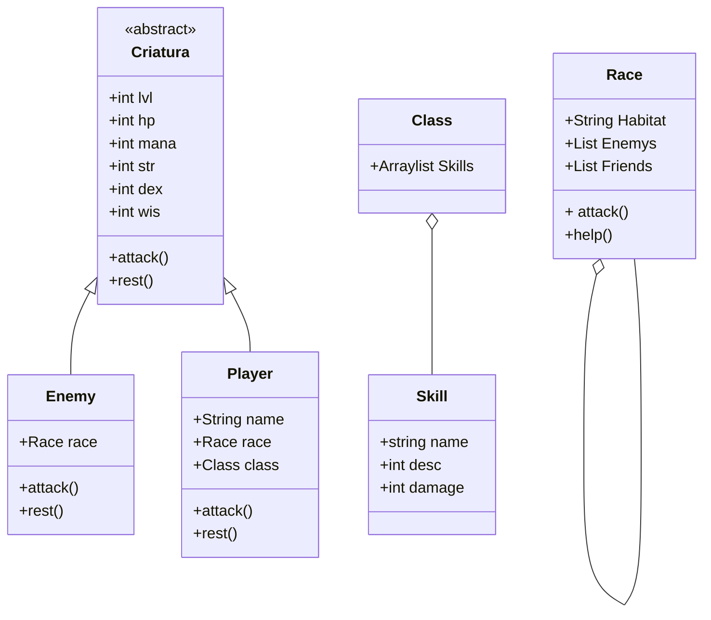

# Diagrama de clases

El siguiente diagrame reprenta la esctructura de clases de la aplicacion

```mermaid
classDiagram
class Criatura{
  +int lvl
  +int hp
  +int mana
  +int str
  +int dex
  +int wis
}
<<abstract>> Criatura
Criatura <|-- Enemy
Criatura <|-- Player
Criatura: +attack()
Criatura: +rest()

class Class{
  +Arraylist<Skill> Skills
}
Class o-- Skill
class Skill{
  +string name
  +int desc
  +int damage
}

class Race{
  +String Habitat
  +List<Race> Enemys
  +List<Race> Friends
}
Race: + attack()
Race: +help()
Race o-- Race

class Player{
  +String name
  +Race race
  +Class class
  +attack()
  +rest()
}

class Enemy{
  +Race race
  +attack()
  +rest()
}
```
