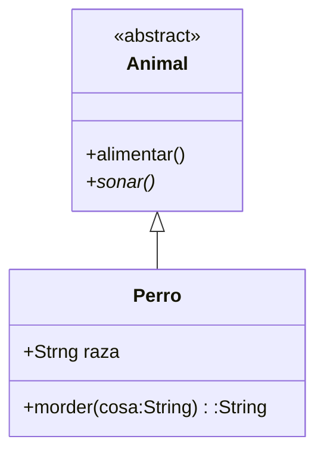

# Diagrama de clases

El siguiente diagrame reprenta la esctructura de clases de la aplicacion

``` java
class Perro extends Animal{
   String raza;
   
   String morder(String cosa){
     return null
  }
} 

abstract class Animal{
  void alimentar(){

  }
  abstract void sonar();
}
```

