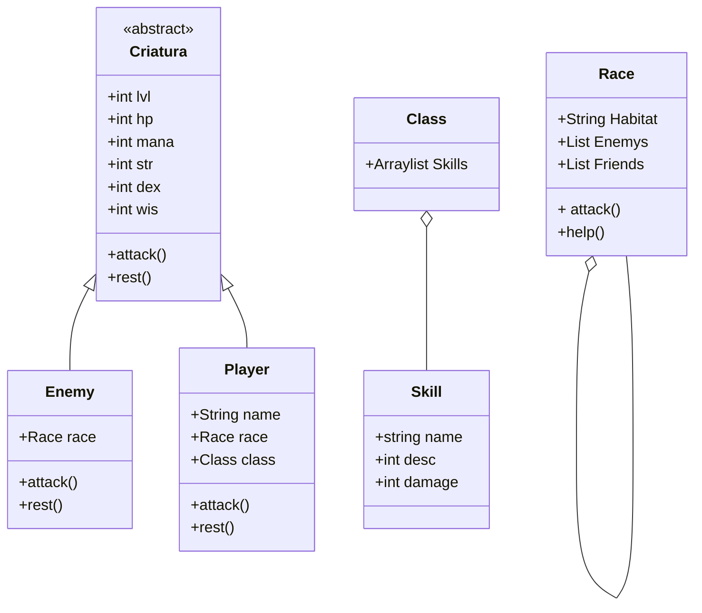
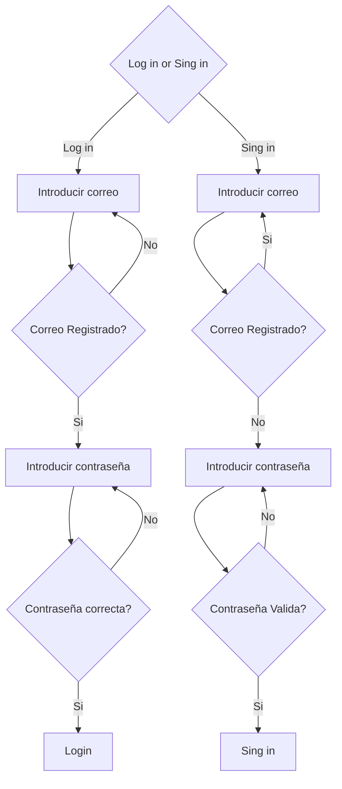
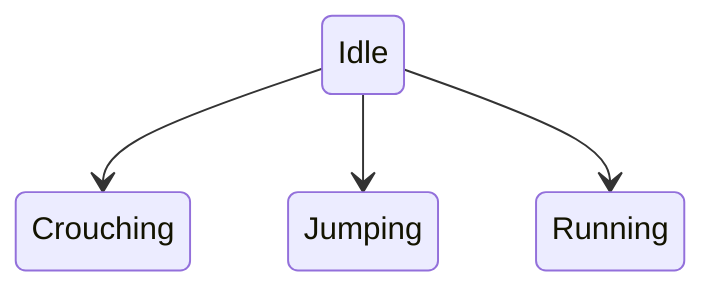
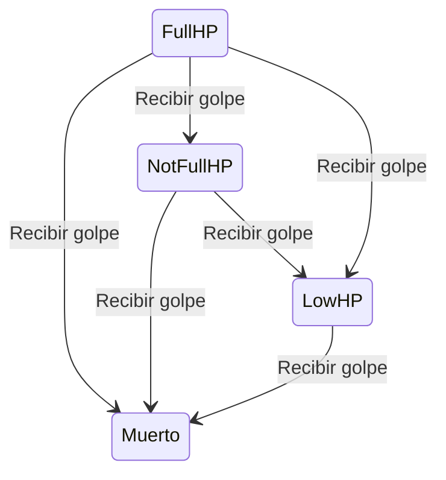

# Diagrama de clases

El siguiente diagrama representa la esctructura de clases de la aplicacion

```mermaid
classDiagram
class Criatura{
  +int lvl
  +int hp
  +int mana
  +int str
  +int dex
  +int wis
}
<<abstract>> Criatura
Criatura <|-- Enemy
Criatura <|-- Player
Criatura: +attack()
Criatura: +rest()

class Class{
  +Arraylist<Skill> Skills
}
Class o-- Skill
class Skill{
  +string name
  +int desc
  +int damage
}

class Race{
  +String Habitat
  +List<Race> Enemys
  +List<Race> Friends
}
Race: + attack()
Race: +help()
Race o-- Race

class Player{
  +String name
  +Race race
  +Class class
  +attack()
  +rest()
}

class Enemy{
  +Race race
  +attack()
  +rest()
}
```
# Diagrama de Actividades

```mermaid
flowchart
    A{Log in or Sing in } --> |Log in|B[Introducir correo]
      B --> C{Correo Registrado?}
      C-->|Si| D[Introducir contraseña]
        D-->E{Contraseña correcta?}
        E-->|Si| F[Login] 
        E-->|No| D
      C-->|No| B
    A --> |Sing in|G[Introducir correo]
      G --> H{Correo Registrado?}
      H-->|No| I[Introducir contraseña]
        I-->J{Contraseña Valida?}
        J-->|Si| K[Sing in] 
        J-->|No| I
      H-->|Si| G
```

# Estados

## Movement

```mermaid
stateDiagram-v2
    state "Idle" as normal
    state "Jumping" as saltando
    state "Crouching" as agachado
    state "Running" as corriendo

    normal --> agachado
    normal --> saltando
    normal --> corriendo
    
```
## HP

```mermaid
stateDiagram-v2
    state "FullHP" as toda
    state "NotFullHP" as sintoda
    state "LowHP" as poca
    state "Muerto" as nada
 
    toda --> sintoda: Recibir golpe
    toda --> nada: Recibir golpe
    sintoda --> poca: Recibir golpe
    toda --> poca: Recibir golpe
    sintoda --> nada: Recibir golpe
    poca --> nada: Recibir golpe
    
```
## 